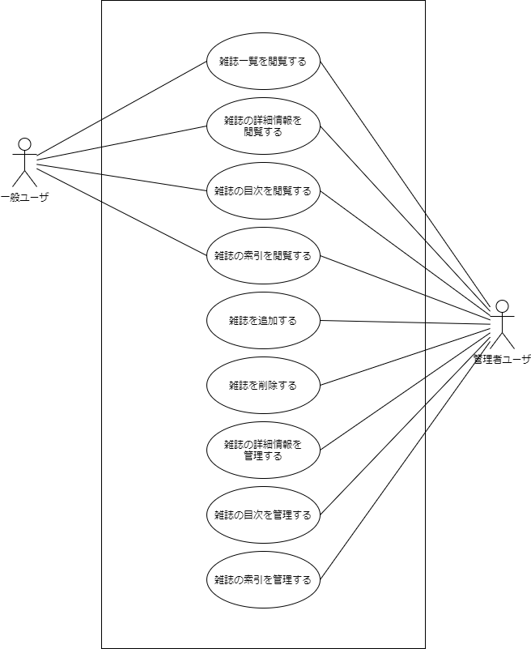

# 要件定義

## 背景・目的
- 特定の年代のゲーム雑誌を収集しているが、所持している雑誌の号数や収録されている記事をデータベース化して管理したい。
- 特定の記事をスキャンしてデジタルデータにしているため、それも管理したい。
- 個人のPCでスタンドアロンで動作するようにしたい。データベースなどを別途用意せず、システムを起動しただけで使えるようにしたい。

## 想定している作業の流れ
1. 実物の雑誌をもとに雑誌名と号数を登録する。
1. 実物の雑誌をもとに雑誌の詳細情報（出版社、発行日など）を登録する。
1. 雑誌の紙面をスキャナで取り込んで電子データ（画像）化する。
    - 表紙
    - 目次ページ
    - 索引ページ
    - 興味のある記事
1. 目次画像をもとに目次の内容を登録する。
1. 索引画像をもとに索引の内容を登録する。
1. 記事の画像を登録する。

## 必要な機能
- 雑誌一覧を閲覧する。
- 雑誌の詳細情報を閲覧する。
- 雑誌の目次を閲覧する。
- 雑誌の索引を閲覧する。
- 雑誌を追加する。
- 雑誌を削除する。
- 雑誌の詳細情報を管理する。
- 雑誌の目次を管理する。
- 雑誌の索引を管理する。

### 将来的に追加したい機能
- 記事の画像データを閲覧する。
- 記事を検索する。
- 記事の画像データを管理する。
- 登録したデータをエクスポートする。

## ユースケース

### ユースケース記述
|ID|ユースケース|
|:--|:--|
|UC001|[雑誌一覧を閲覧する](uc001.md)|
|UC002|[雑誌の詳細情報を閲覧する](uc002.md)|
|UC003|[雑誌の目次を閲覧する](uc003.md)|
|UC004|[雑誌の索引を閲覧する](uc004.md)|
|UC005|[雑誌を追加する](uc005.md)|
|UC006|[雑誌を削除する](uc006.md)|
|UC007|[雑誌の詳細情報を管理する](uc007.md)|
|UC008|[雑誌の目次を管理する](uc008.md)|
|UC009|[雑誌の索引を管理する](uc009.md)|

## 利用者
- 一般ユーザ
  - ログイン不要
- 管理者ユーザ
  - ログインが必要
  - データベースに直接レコードを作成して登録する（ユーザ登録画面を作らない）

## 配布方法
実行可能な形式（exe等）で配布する。  
Spring Bootで作成する場合、実行可能jar形式でデプロイできる。  

## データベース
組み込みDBを使う。  
H2DBはサーバモードでも組み込みモードでも使える。  

<!--
## テーブル一覧
- 雑誌
    - 雑誌名
    - 号数
    - 出版社
    - 発行日
- 記事
    - タイトル
    - サブタイトル
    - 開始ページ
- キーワード
    - キーワード
    - 開始ページ
-->
